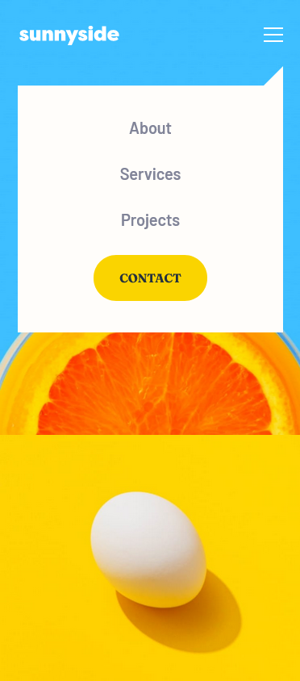

# Frontend Mentor - Sunnyside agency landing page solution

This is a solution to the [Sunnyside agency landing page challenge on Frontend Mentor](https://www.frontendmentor.io/challenges/sunnyside-agency-landing-page-7yVs3B6ef). Frontend Mentor challenges help you improve your coding skills by building realistic projects!

## Table of contents

- [Overview](#overview)
  - [The challenge](#the-challenge)
  - [Screenshot](#screenshot)
  - [Links](#links)
- [My process](#my-process)
  - [Built with](#built-with)
  - [What I learned](#what-i-learned)
  - [Continued development](#continued-development)
  - [Useful resources](#useful-resources)
- [Author](#author)

## Overview

### The challenge

Users should be able to:

- View the optimal layout for the site depending on their device's screen size
- See hover states for all interactive elements on the page

### Screenshot

Solution in mobile 📱:




Solution in desktop 💻:


### Links

- Solution URL: [Click here](https://www.frontendmentor.io/solutions/mobilefirst-site-sunnyside-agency-landing-page-pA-NOOWji#comment-61a5869dbb27946dd37a9961)
- Live Site URL: [See live site here](https://juanbonilla.me/FEM_sunnyside-agency-landing-page/)

## My process

### Built with

- Semantic HTML5 markup
- SCSS / CSS custom properties
- Flexbox
- CSS Grid
- Mobile-first workflow
- BEM Methodology
- JavaScript

### What I learned

I learned how to get missing resources. For example, the default assets did not have white icons for the social media section. I took the images, changed the color to white and added those new assets to my folder; doing that helped me to easily handle the hover state for those icons.

On the other hand, the following block of js code helped me to prevent secondary effects on my navigation menu, this is caused when you resize the screen and turns to a desktop size. Using this code I can remove the css class that was showing my menu on mobile.

```js
window.addEventListener('resize', () => {
    if(window.innerWidth > 1100) {
        navMenu.classList.remove('show-menu');
    }
});
```

### Continued development

I've been trying to reduce the amount of lines in SCSS but I want to do it better. I will find out new techniques to reduce styles lines when writting media queries to make my code cleaner.

### Useful resources

- [Window resize event](https://developer.mozilla.org/en-US/docs/Web/API/Window/resize_event) - This helped me to fix an issue when you decided to activate the navigation menu on a mobile view and rotate or increase the screen size to a value that matches the width of a desktop device, making the menu to look strange. 

## Author

- Website - [juanbonilla.me](https://juanbonilla.me)
- Frontend Mentor - [@juanpb96](https://www.frontendmentor.io/profile/juanpb96)
- LinkedIn - [Juan Bonilla](https://www.linkedin.com/in/juan-pablo-bonilla-6b8730115/)